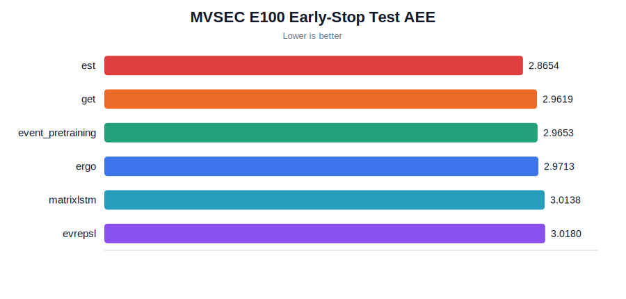
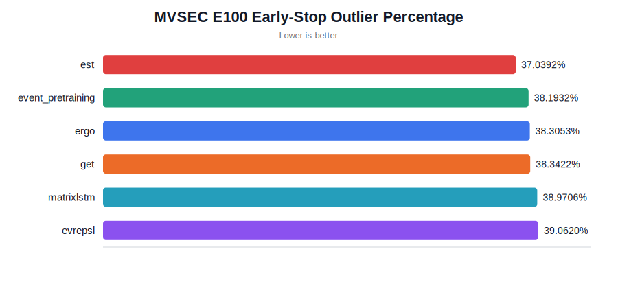
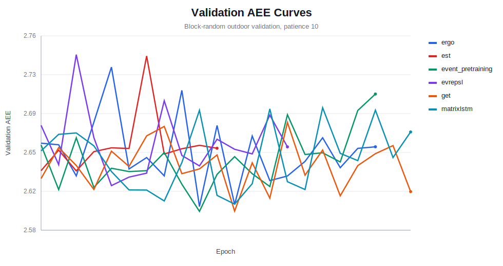

# MVSEC Optical Flow E100 Early-Stop Results

## Status

This run completed all six runnable event-representation methods under the same MVSEC optical-flow downstream benchmark.

## Protocol

- Train sequences: `outdoor_day1`, `outdoor_day2`.
- Test sequences: `indoor_flying1`, `indoor_flying2`, `indoor_flying3`.
- Event window: 6M events.
- Flow GT: generated from all available MVSEC GT frames for the selected sequences.
- Max epochs: 100.
- Early stopping: patience 10, block-random validation sampled from outdoor training windows.
- Metrics: AEE/EPE and outlier percentage. Lower is better.

## Results

| Method | AEE | Outlier % | Non-outlier % | Epochs | Best epoch | Best val AEE | Train windows | Eval windows |
|---|---:|---:|---:|---:|---:|---:|---:|---:|
| ergo | 2.9713 | 38.31 | 61.69 | 20 | 10 | 2.6049 | 16329 | 3583 |
| est | 2.8654 | 37.04 | 62.96 | 11 | 1 | 2.6380 | 16329 | 3583 |
| event_pretraining | 2.9653 | 38.19 | 61.81 | 20 | 10 | 2.6004 | 16329 | 3583 |
| evrepsl | 3.0180 | 39.06 | 60.94 | 15 | 5 | 2.6243 | 16329 | 3583 |
| get | 2.9619 | 38.34 | 61.66 | 22 | 12 | 2.6007 | 16329 | 3583 |
| matrixlstm | 3.0138 | 38.97 | 61.03 | 22 | 12 | 2.6071 | 16329 | 3583 |
| OmniEvent✳ | 0.9900 | 3.24 | 96.76 | paper | paper | paper | paper | paper |

✳ OmniEvent is a paper-reported reference row. Its displayed values are simple averages from the OmniEvent paper's MVSEC `indoor_flying1/2/3` results, not a local run in this repository. Source: [arXiv:2508.01842](https://arxiv.org/abs/2508.01842), Table 2.

## Reporting Notes

- This is a unified downstream optical-flow benchmark / adapted reproduction, not an exact reimplementation of each paper's original optical-flow decoder.
- The six event representations are compared under the same EVFlowNet-like decoder and the same MVSEC train/eval protocol, so the comparison is fair inside this benchmark.
- The next rerun uses timestamp-aligned event intervals from flow GT timestamps. The checked-in 20260501 numbers below come from the earlier unified pipeline and should be treated as the previous result package.
- `OmniEvent✳` is included only as reported-only context and should not be ranked as a local result from this pipeline.
- W&B hooks exist in the code. The current deliverable uses local CSV curves and SVG figures, which are enough for reporting unless an online W&B dashboard is explicitly required.

## Figures

## Review Notes

1. The result should be described as an adapted reproduction / unified downstream optical-flow benchmark, not a bit-for-bit reproduction of every paper's original decoder.
2. The shared EVFlowNet-like decoder keeps the comparison fair across six methods, especially because several papers do not provide optical-flow downstream code.
3. The updated runner pairs event windows to flow frames by timestamp intervals when flow timestamps are available, while still keeping the shared downstream decoder.
4. Local CSV curves are available in `artifacts/e100_earlystop_20260501/logs/curves`. W&B support is implemented but was not used for this result package.
